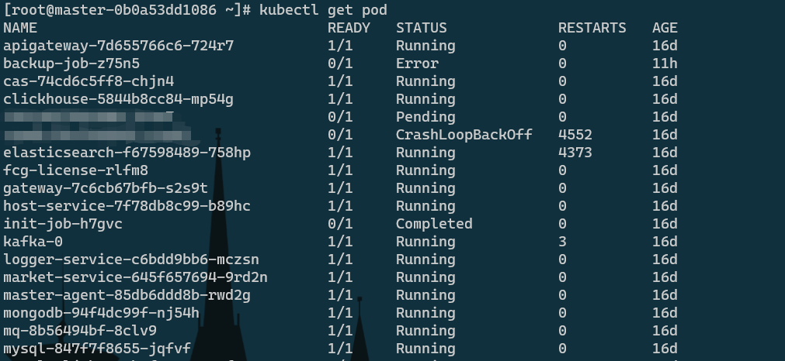
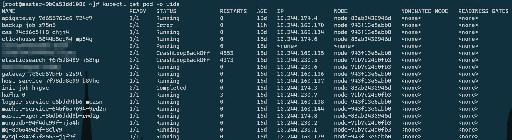
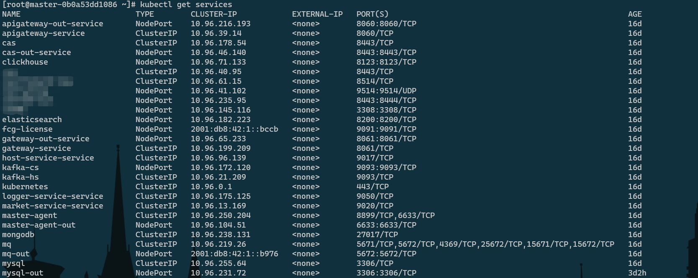

# kubernetes

## 常用命令

* 查看pod列表

```
kubectl get pod [-o wide] [-n NAMESPACE | -A]
	# -o wide ：查看pod运行在哪个节点上以及ip地址信息
	# -n NAMESPACE ：指定命名空间
	# --all-namespaces : 所有命名空间
	# --include-uninitialized : 包括未初始化的
```





* 查看service列表

```
kubectl get service
```

