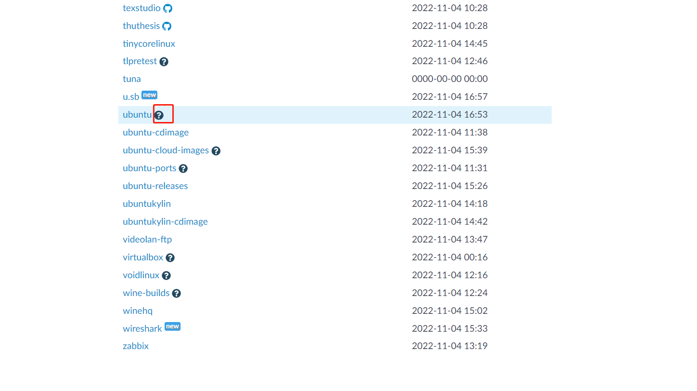

# Ubuntu

## 防火墙

1. 先看下是否安装了防火墙, ```sudo ufw version```
   * 安装过程如下:
     1. ```sudo apt-get install ufw```
2. 禁用防火墙```sudo ufw disable```

其他:

* 启用防火墙```sudo ufw enable```
* 关闭所有外部访问```sudo ufw default deny```
* ```sudo ufw allow smtp```  允许所有的外部IP访问本机的25/tcp (smtp)端口
* ```sudo ufw allow 22/tcp``` 允许所有的外部IP访问本机的22/tcp (ssh)端口
* ```sudo ufw allow 53``` 允许外部访问53端口(tcp/udp)
* ```sudo ufw allow from 192.168.1.100``` 允许此IP访问所有的本机端口
* 查看防火墙状态```sudo ufw status```

## 指定软件仓库的镜像源

系统中默认的镜像源可能访问不到, 需要手动修改镜像源.

1. 备份原镜像源配置文件: ```cp /etc/apt/sources.list /etc/apt/sources.list.bak```;
2. 修改镜像源配置文件: ```vi /etc/apt/sources.list```
```
# 默认注释了源码镜像以提高 apt update 速度，如有需要可自行取消注释
deb https://mirrors.tuna.tsinghua.edu.cn/ubuntu/ focal main restricted universe multiverse
# deb-src https://mirrors.tuna.tsinghua.edu.cn/ubuntu/ focal main restricted universe multiverse
deb https://mirrors.tuna.tsinghua.edu.cn/ubuntu/ focal-updates main restricted universe multiverse
# deb-src https://mirrors.tuna.tsinghua.edu.cn/ubuntu/ focal-updates main restricted universe multiverse
deb https://mirrors.tuna.tsinghua.edu.cn/ubuntu/ focal-backports main restricted universe multiverse
# deb-src https://mirrors.tuna.tsinghua.edu.cn/ubuntu/ focal-backports main restricted universe multiverse
deb https://mirrors.tuna.tsinghua.edu.cn/ubuntu/ focal-security main restricted universe multiverse
# deb-src https://mirrors.tuna.tsinghua.edu.cn/ubuntu/ focal-security main restricted universe multiverse

# 预发布软件源，不建议启用
# deb https://mirrors.tuna.tsinghua.edu.cn/ubuntu/ focal-proposed main restricted universe multiverse
# deb-src https://mirrors.tuna.tsinghua.edu.cn/ubuntu/ focal-proposed main restricted universe multiverse
```
3. 更新软件中心```sudo apt-get update```(如果执行失败, 尝试把https改为http试试)
4. 更新本地软件```sudo apt-get upgrade```
5. 完成.

## java安装

1. 执行```sudo apt update```;
2. 执行```sudo apt install openjdk-11-jdk```;
3. 验证```java -version```;
4. 完成.

## mysql安装

**安装**

1. 检查是否已安装mysql```sudo netstat -tap | grep mysql```;
2. 安装mysql```sudo apt-get install mysql-server mysql-client```
3. 验证是否安装成功```sudo netstat -tap | grep mysql```

**修改root密码**

1. 接下来修改随机生成的初始密码, 首先查看随机生成的密码```sudo cat /etc/mysql/debian.cnf```
2. 根据文件中给出的用户名密码进行登录```mysql -udebian-sysmaint -pinput_the_password```
3. 登录成功后, 执行```use mysql;```
4. 修改密码为123456: ```update mysql.user set authentication_string=password('123456') where user='root' and Host ='localhost';```
5. 再执行这个```update user set  plugin="mysql_native_password"; ```
6. 刷新权限```flush privileges;```, 至此, 密码修改完成;


**使能外部访问**

1. 首先确定防火墙是否对该端口有限制(3306端口)
2. 登录mysql客户端;
3. 执行```use mysql;```;
4. 执行```select host from user where user='root';```发现确实限制了登录;
5. 执行```update user set host = '%' where user = 'root';```修改登录限制;
6. 刷新权限;
7. 修改配置文件(对于mysql8.0), ```sudo nano /etc/mysql/mysql.conf.d/mysqld.cnf```, 修改其中的配置为```bind-address = 0.0.0.0```;
8. 重启mysql.


mysql启停命令:

```
启动mysql：
方式一：sudo /etc/init.d/mysql start
方式二：sudo service mysql start

停止mysql：
方式一：sudo /etc/init.d/mysql stop
方式二：sudo service mysql stop

重启mysql：
方式一：sudo/etc/init.d/mysql restart
方式二：sudo service mysql restart
```

## 配置静态ip

> 基于ubuntu20.04版本

1. 查看当前网卡信息, 可以看到是```enp0s3```:

```bash
stack@frog-VirtualBox:~$ ifconfig
enp0s3: flags=4163<UP,BROADCAST,RUNNING,MULTICAST>  mtu 1500
        inet 10.0.2.66  netmask 255.255.255.0  broadcast 10.0.2.255
        inet6 fe80::a00:27ff:fe66:8323  prefixlen 64  scopeid 0x20<link>
        ether 08:00:27:66:83:23  txqueuelen 1000  (Ethernet)
        RX packets 130889  bytes 178169269 (178.1 MB)
        RX errors 0  dropped 0  overruns 0  frame 0
        TX packets 39846  bytes 3713094 (3.7 MB)
        TX errors 0  dropped 0 overruns 0  carrier 0  collisions 0

lo: flags=73<UP,LOOPBACK,RUNNING>  mtu 65536
        inet 127.0.0.1  netmask 255.0.0.0
        inet6 ::1  prefixlen 128  scopeid 0x10<host>
        loop  txqueuelen 1000  (Local Loopback)
        RX packets 214  bytes 18192 (18.1 KB)
        RX errors 0  dropped 0  overruns 0  frame 0
        TX packets 214  bytes 18192 (18.1 KB)
        TX errors 0  dropped 0 overruns 0  carrier 0  collisions 0
```

2. 查看网关:

```bash
frog@frog-VirtualBox:~$ route -n
Kernel IP routing table
Destination     Gateway         Genmask         Flags Metric Ref    Use Iface
0.0.0.0         10.0.2.2        0.0.0.0         UG    100    0        0 enp0s3
10.0.2.0        0.0.0.0         255.255.255.0   U     100    0        0 enp0s3
169.254.0.0     0.0.0.0         255.255.0.0     U     1000   0        0 enp0s3
```

3. 修改配置文件, ```vim /etc/netplan/01-network-manager-all.yaml```:

```yaml
# Let NetworkManager manage all devices on this system
network:
  version: 2
  renderer: NetworkManager
```

修改为:

```yaml
network:
  version: 2
  renderer: NetworkManager
  ethernets:
    enp0s3:  #配置的网卡名称
      dhcp4: no    #dhcp4关闭
      dhcp6: no    #dhcp6关闭
      addresses: [10.0.2.66/24]   #设置本机IP及掩码
      optional: true
      gateway4: 10.0.2.2   #设置网关
      nameservers:
          addresses: [114.114.114.114]   #设置DNS
```

4. 执行```netplan apply```

5. 重启, 查看```ifconfig```可以发现修改成功

## 修改镜像源

1. 进入配置目录, ```cd /etc/apt/```
2. 备份原始镜像源, ```cp -a sources.list sources.list.bk```
3. 访问清华大学官方镜像站: https://mirrors.tuna.tsinghua.edu.cn/
4. 找到Ubuntu, 点击帮助按钮.



5. 在帮助页面, 选择指定的Ubuntu版本, 复制, 替换即可.