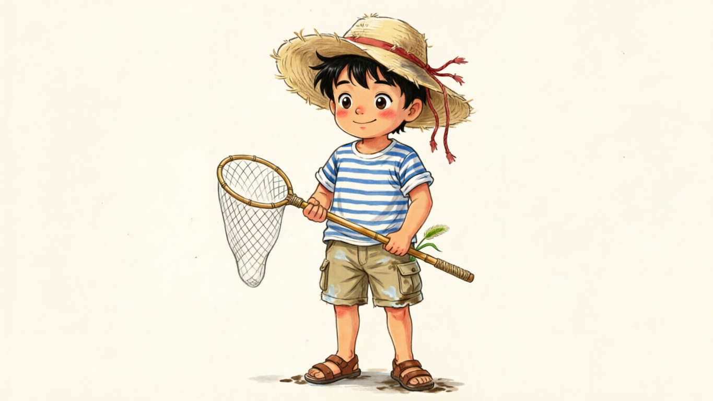
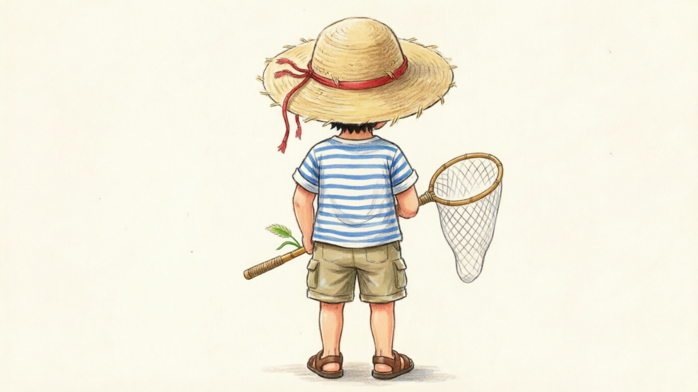
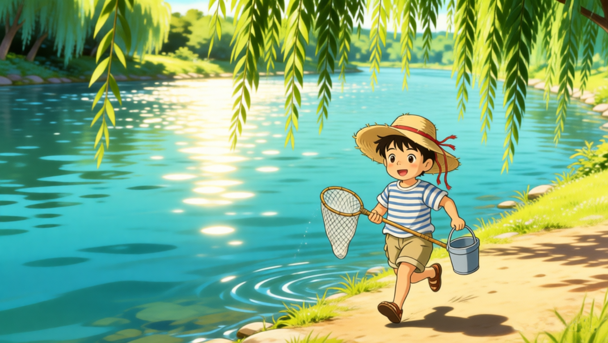
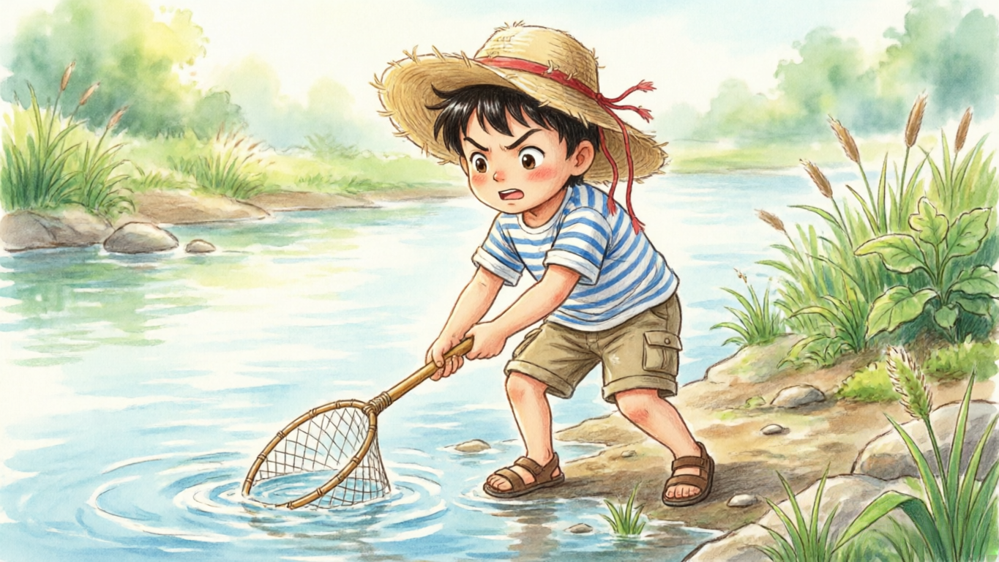
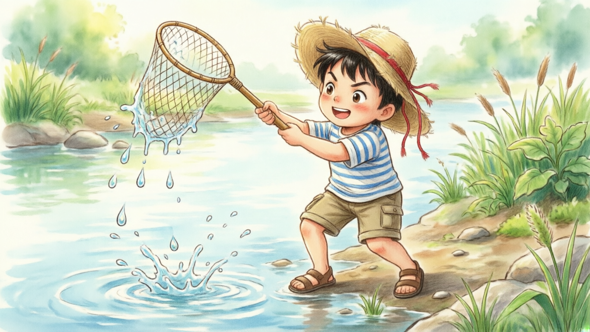
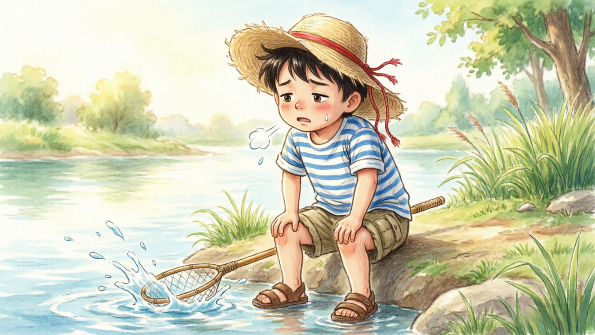
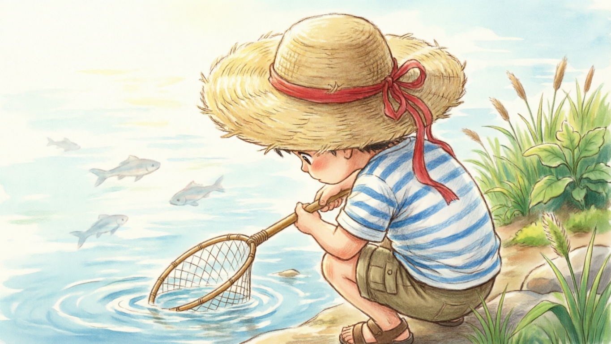
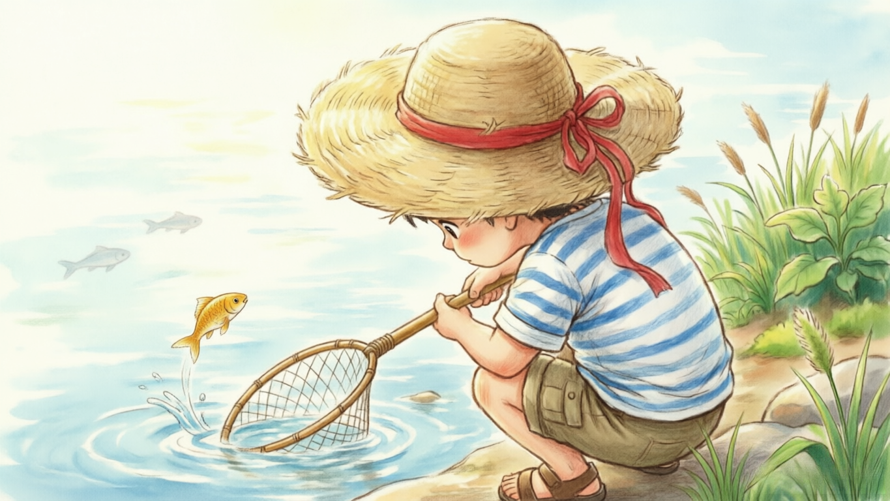
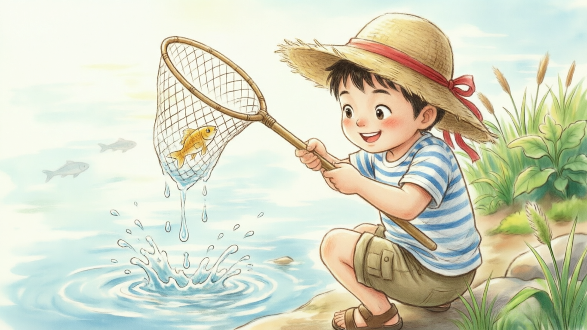

## 概述

* 剧本/脚本创作: 千问/豆包
* 文生图: 千问/豆包/Running Hub
* 视频生成: 即梦/可灵/comfyui
* 视频剪辑: 剪映
* 配音: 剪映
* 配乐: 即梦/可灵/剪映/豆包
* 一站式制作: lovart

> 文中示例实际使用软件: 1. 千问(剧本创作/脚本创作/文生图); 3. 360图片编辑(去水印); 3. 即梦(视频生成); 4. 剪映(剪辑/配音)

## 1. 剧本

提示词示例:

```markdown
你是一个经验丰富的动画电影导演, 现在我需要你写一个动画电影短片的故事剧本《小明夏日河边捕鱼》,情节简单, 故事有逻辑, 3D卡通风格, 以写故事的方式提供给我, 以便于我能快速了解故事内容, 不超过100字.  
```

生成结果:
```
夏日河边，卡通小明戴草帽持网兜捕鱼。屡扑空后静观水面，终见大鱼跃起，他轻巧兜住却心生怜悯，笑着放生。夕阳下空桶归家，虽无鱼获，心中满载对自然的敬意与夏日欢愉。
```

> 通常情况下, 400字的剧本对应2分钟的视频时长.

## 2. 脚本

提示词示例:

```markdown
你是一位专业的影视分镜脚本攥写师，擅长为AI短视频生成设计场景与镜头语言。请你根据以下要求编写一段【30秒左右】的视频脚本。

内容是：夏日河边，卡通小明戴草帽持网兜捕鱼。屡扑空后静观水面，终见大鱼跃起。夕阳下空桶归家，虽无鱼获，心中满载对自然的敬意与夏日欢愉。

要求如下：
1.将视频拆分成4个镜头（每个镜头大约5秒）；
2.每个镜头需包括镜头类型（如远景、俯拍、跟拍等）、画面内容、动作描述、情绪渲染；
3.保证画面主体一致性、风格一致性。
4.视频为无对白表现，请用画面细节和镜头语言传达节奏；
5.输出格式：镜头编号+画面描述+AI绘画提示词（汉语），并以表格的形式回答。
```

> 需要保证AI生成的画面描述客观直观, 不要有比喻/拟人等修辞, 会误导AI生成.

生成结果:

| 镜头编号 | 画面描述（含镜头类型、内容、动作、情绪）                                                                                                                                 | AI绘画提示词（汉语）                                                                                                                                     |
| :-------- | :------------------------------------------------------------------------------------------------------------------------------------------------------------------------- | :--------------------------------------------------------------------------------------------------------------------------------------------------------- |
| 1         | **远景·横移跟拍**：夏日午后河畔，绿柳垂丝，波光粼粼。卡通小明头戴宽檐草帽、身穿蓝白条纹短袖短裤，手持长柄网兜沿河岸轻快小跑，身影在草地上投下跳跃的影子。情绪：活泼期待。 | 夏日河边远景，卡通风格小男孩戴草帽穿蓝白条纹衣裤，手持网兜沿河岸奔跑，绿柳垂丝水面波光粼粼，明亮暖色调，吉卜力动画风格，无文字                             |
| 2         | **中景·固定镜头**：小明连续三次挥网扑空，水花四溅却一无所获。他停下动作，双手撑膝微微喘气，草帽歪斜，表情从兴奋转为些许失落。情绪：挫败但童真未减。                       | 卡通小男孩河边挥网捕鱼扑空，水花飞溅，双手撑膝喘气，草帽歪斜表情失落，蓝白条纹衣裤，夏日河岸背景，柔和自然光，手绘动画质感，无对白                         |
| 3         | **特写·低角度仰拍**：小明蹲在水边静观水面，眼神专注而温柔。突然一条金色大鱼跃出水面，鳞光闪烁；他迅速而轻柔地用网兜接住，动作流畅如舞蹈。情绪：惊喜与敬畏交织。             | 低角度特写，卡通小男孩蹲在水边凝视水面，金色大鱼跃出瞬间被网兜轻柔接住，水珠晶莹鳞光闪烁，眼神温柔专注，夕照初现，清新水彩画风，无文字                     |
| 4         | **远景·逆光剪影**：夕阳熔金，小明提着空桶踏着余晖归家，身影拉得细长。河面泛着琥珀色光泽，晚风轻拂草帽飘带。虽桶空无一物，步伐却轻盈欢快。情绪：宁静丰盈，对自然的礼赞。 | 夕阳逆光远景，卡通小男孩提空桶踏余晖归家，剪影修长草帽飘带轻扬，河面琥珀色波光，温暖橙黄调，诗意手绘风格，传达宁静欢愉与自然敬意，无文字无面部细节         |

## 3. 分镜图片

### 3.1 角色设定

角色设定生成提示词:

```markdown
帮我生成小明的角色设定: 主要包括以下几方面: 1. 外貌; 2. 服装; 3. 特征. 4. 视觉关键词
```

生成结果:

```markdown
### 卡通小明角色设定

#### 1. 外貌
-   **年龄感**：7-8岁男童身形，头身比约为1:4，保留幼儿圆润感但四肢已显修长，符合“活泼好动”的年龄特征。
-   **面部特征**：圆脸配短下巴，脸颊带自然腮红；黑色短发微翘，额前有几缕不服帖的碎发，体现户外活动的随性；眼睛为深棕色大圆眼，瞳仁高光点偏上，传递清澈、好奇与善良的神态；鼻梁小巧，嘴角默认微扬，自带亲和力。
-   **肤色与体态**：健康的小麦色皮肤（非苍白），暗示长期户外活动；体型偏瘦但结实，手臂与小腿有轻微肌肉线条，支撑“挥网捕鱼”“奔跑”等动作的合理性。

#### 2. 服装
-   **上衣**：蓝白细条纹短袖T恤，领口为白色罗纹圆领，袖口微微卷起露出手腕；面料呈现棉质褶皱感，避免光滑塑料质感，增强真实童趣。
-   **下装**：卡其色工装短裤，裤长至膝盖上方3cm，侧边有两个立体贴袋（袋盖可翻折），裤脚有磨损痕迹与浅色泥点，呼应“河边扑空”的情节细节。
-   **配饰**：宽檐米黄色草帽，帽檐边缘有手工编织的不规则纹理，帽顶系一条褪色红绳（防止被风吹走）；脚穿棕色皮质凉鞋，鞋带为交叉绑带式，鞋底沾有少量河泥，强化场景代入感。
-   **道具**：手持长柄竹制网兜，网兜为白色尼龙材质，网眼大小适中（能看清鱼形但不显密集），竹柄表面有使用留下的光滑包浆，末端缠一圈防滑麻绳。

#### 3. 特征
-   **动态标识**：奔跑时草帽会随惯性向后倾斜，红绳飘动；挥网时身体重心前倾，手臂伸展幅度大，衣摆随动作掀起一角；静观水面时会不自觉用食指轻点下巴，体现专注思考的习惯性小动作。
-   **情绪符号**：失落时草帽会遮住半张脸，肩膀微微下沉；惊喜时眼睛弯成月牙，腮红更明显；放生时嘴角上扬弧度柔和，眼神向下凝视，传递温柔的共情力。
-   **环境互动痕迹**：衣服下摆偶尔沾有水渍，裤袋里露出一截狗尾巴草（暗示途中采摘），草帽内侧有汗渍形成的深色印记，所有细节均服务于“夏日河边”的场景真实性，避免角色悬浮于画面。

#### 4. 视觉关键词
吉卜力手绘风、蓝白条纹、米黄草帽、小麦肤色、圆润童颜、竹柄网兜、工装短裤、自然光影、治愈系配色、动态褶皱、环境互动细节、无文字符号、高饱和度暖调、柔软线条、童真神态
```

> 在上述结果的最后追加一段图片比例控制(或者大部分文生图都可以选择比例): `根据以上描述生成小明的正面全身照, 比例 [16:9]` (横屏推荐: 16:9, 竖屏推荐: 9:16)

小鱼角色设定:

```
帮我生成小鱼的角色设定: 主要包括以下几方面: 1. 特征. 2. 视觉关键词
```

生成结果:





### 3.2 关键帧

核心维度:

* 景别: 特写(特写), 中景(中景), 远景(广角)
* 主体: 张三, 李四, 王五
* 光影: 柔和侧光, 丁达尔效应, 逆光, 黄金小时
* 色调: 复古电影色调, 冷色调, 莫兰迪色, 高饱和度
* 构图: 三分法构图, 对称构图, S形曲线, 低角度仰拍
* 质感: 胶片质感, 8K分辨率, 虚幻引擎渲染, 细腻纹理

提示词技巧:

1. 直观与客观: 拒绝文学修饰, 拥抱物理语言
2. 导演式拆解: 脚本只是辅助参考, 真正的画面拆解必须靠我们自己独立思考(大模型生成的会有问题, 必须自己检查修正)
3. 平替与优化: 要适当的修改提示词描述的内容
4. 对口型: 必须使用近景正面镜头, 以确保数字人驱动时的口型匹配度与面部自然度.

操作流程:

* 输入: 角色图, 描述
* 输出: 场景图(关键帧)

示例:

帧描述|提示词|图片|备注
-|-|-|-
分镜1|根据这个小男孩的形象生成. 夏日河边超广角远景，小男孩手持网兜沿河岸奔跑，绿柳垂丝水面波光粼粼，明亮暖色调，吉卜力动画风格，(小男孩占比小些)||无
分镜2(首帧)|根据这个小男孩的形象生成. 夏日河边中景. 小男孩河边将网放入河水里, 紧张的尝试捕鱼，夏日河岸背景，柔和自然光，手绘动画质感，无对白||无
分镜2(中间帧)|参考这个场景生成. 夏日河边中景. 小男孩向空中扬起抄网, 有水滴从抄网上飞溅||参考分镜2首帧图
分镜2(尾帧)|根据这个小男孩的形象生成. 夏日河边中景. 小男孩河边挥网捕鱼扑空，水花飞溅，双手撑膝喘气，草帽歪斜表情失落，蓝白条纹衣裤，夏日河岸背景，柔和自然光，手绘动画质感，无对白||无
分镜3(首帧)|从小男孩身后俯视特写, 小男孩手持抄网蹲在水边凝视水面. 注意: 画面上看见的是小男孩的帽顶帽檐, 以及水面, 以及水中若隐若现的小鱼影子. 看不到面部.||参考分镜2(尾帧)
分镜3(中间帧)|突然金色小小小鱼跃出水面, 鱼尺寸要很小, 并且在抄网左侧一定距离||参考分镜3(首帧)
分镜3(尾帧)|小男孩兴奋抬起照抄网, 将小鱼轻柔收入网中，水珠晶莹||参考分镜3(中间帧)
分镜4(首帧)|根据这个小男孩的形象生成. 远景·逆光剪影: 夕阳熔金，小男孩斜背对镜头, 提着水桶拿着抄网, 踏着余晖归家，身影拉得细长。河面泛着琥珀色光泽，晚风轻拂草帽飘带。步伐却轻盈欢快。明亮暖色调，吉卜力动画风格，(小男孩占比小些) 画面尺寸 16:9||参考分镜1和角色背景图

> 1. 就是把脚本生成的AI绘画提示词微调后放进去
> 2. 注意生成的图片是否有水印

## 4. 视频生成

操作流程:

* 输入: 首帧/尾帧/多帧生成, 描述
* 输出: 视频

> 对口型需使用数字人功能(即梦)


* 分镜1:
    - 提示词: 远景·横移跟拍：夏日午后河畔，绿柳垂丝，波光粼粼。小明头戴宽檐草帽、身穿蓝白条纹短袖短裤，手持长柄网兜和水桶沿河岸轻快小跑，身影在草地上投下跳跃的影子。情绪：活泼期待。
* 分镜2:
    - 提示词1: 小明在水中反复移动抄网, 然后突然抬起, 抄网中空无一物, 水花四溅
    - 提示词2: 抄网中一无所获。他停下动作, 扔下抄网，双手撑膝微微喘气，草帽歪斜，表情从兴奋转为些许失落。情绪：挫败但童真未减。
* 分镜3:
    - 提示词1: 小明蹲在水边静观水面，眼神专注而温柔。突然旁边一条金色小小小小鱼跃出水面
    - 提示词2: 小明迅速而轻柔地用网兜接住跃出水面的小鱼
* 分镜4:
    - 提示词: 夕阳熔金，小明提着水桶拿着抄网, 踏着余晖归家，身影拉得细长。河面泛着琥珀色光泽，晚风轻拂草帽飘带。情绪：宁静丰盈，夏日礼赞。

> 实际制作过程中, 发现分镜3比较复杂, 因此将分镜3拆分成了两个分镜, 分别生成视频, 最后拼接在一起了.

## 5. 配音/配乐

* 配音
    * 旁白配音
    * 角色配音
    * 其他音效(水声等)
* 配乐
    * 纯音乐
    * bgm

## 6. 剪辑成片

软件: 剪映