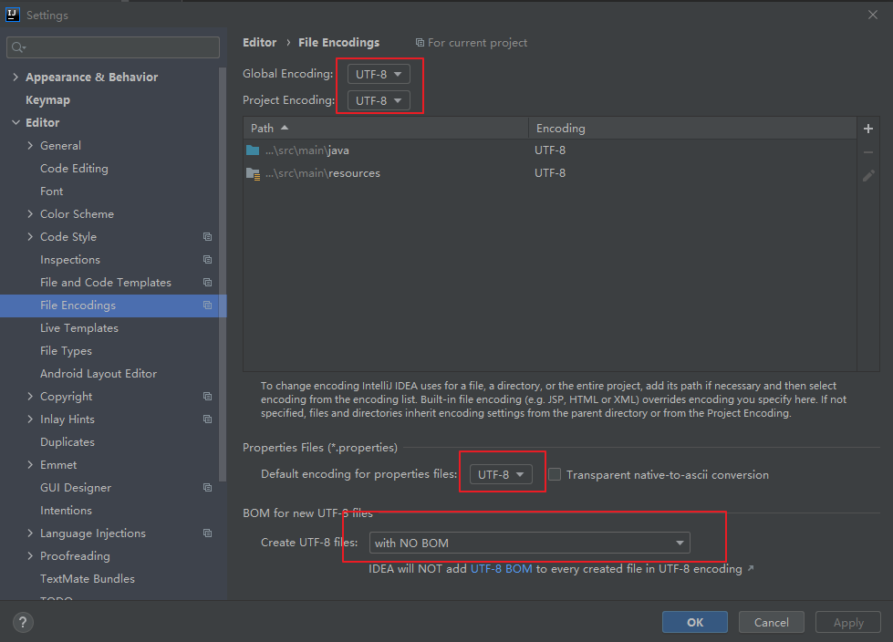
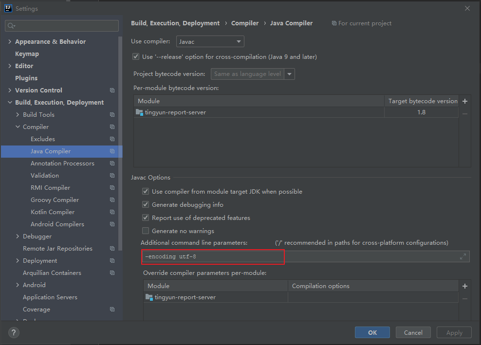
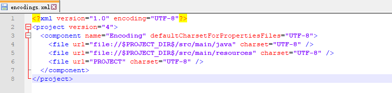
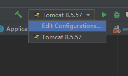
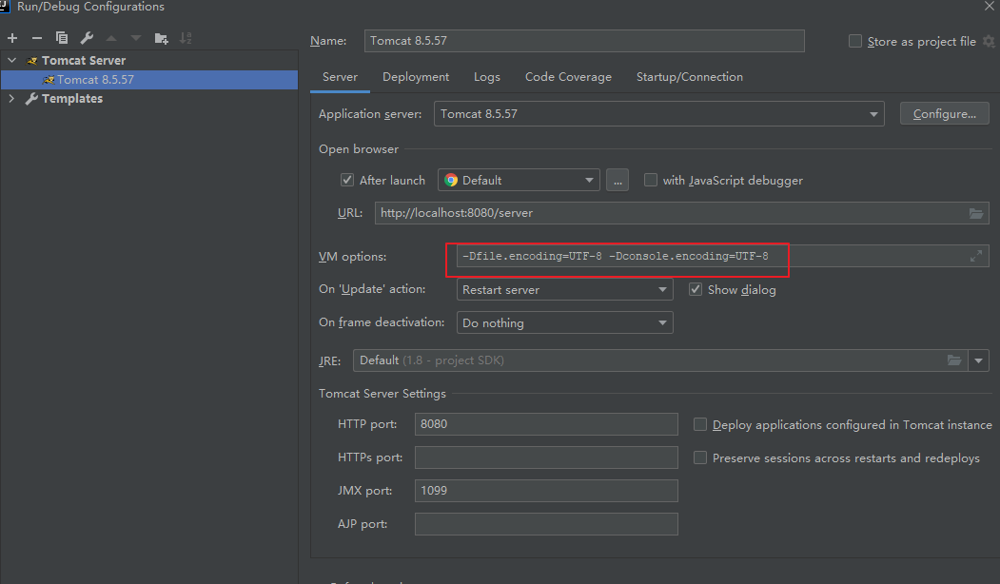

# Idea相关

## Idea乱码

1. File - Setting - Editor - File Encodings



2. File - Setting - Build,Execution,Deployment - Java Compiler



3. 项目所在目录.idea文件夹 - encodings.xml文件, 所有非UTF-8改为UTF-8



4. 启动配置





5. IntelliJ IDEA本地安装目录中bin文件夹下的idea.exe.vmoptions和idea64.exe.vmoptions:
添加:

```
-Dfile.encoding=UTF-8
-Dconsole.encoding=UTF-8
```

6.  Help->Edit Custom Vm Options..., 添加:

```
-Dfile.encoding=UTF-8
-Dconsole.encoding=UTF-8
```

7. 检查C:\Users\用户名\.IntelliJIdeaxxxx\config, 中是否有idea64.exe.vmoptions或者idea6.exe.vmoptions, 如果有, 也像上面那样修改
8. 重启IDEA