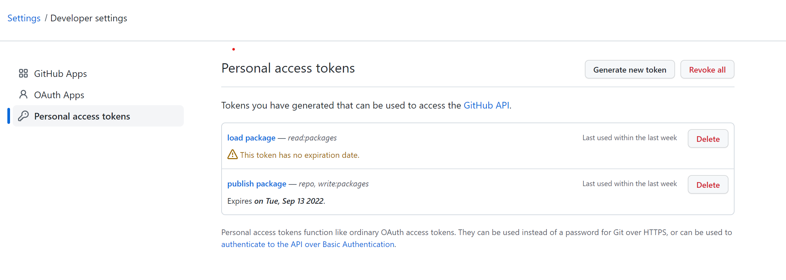
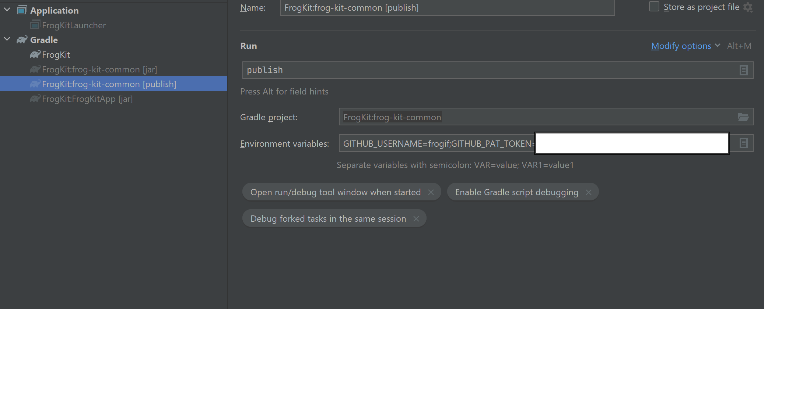
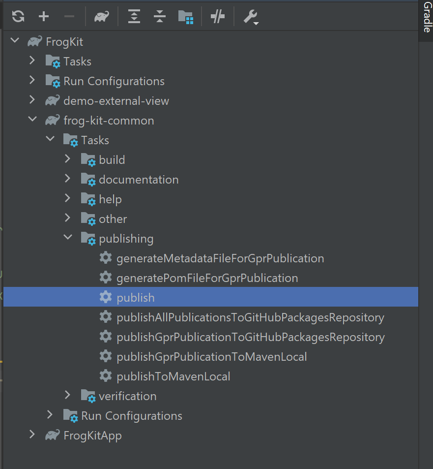
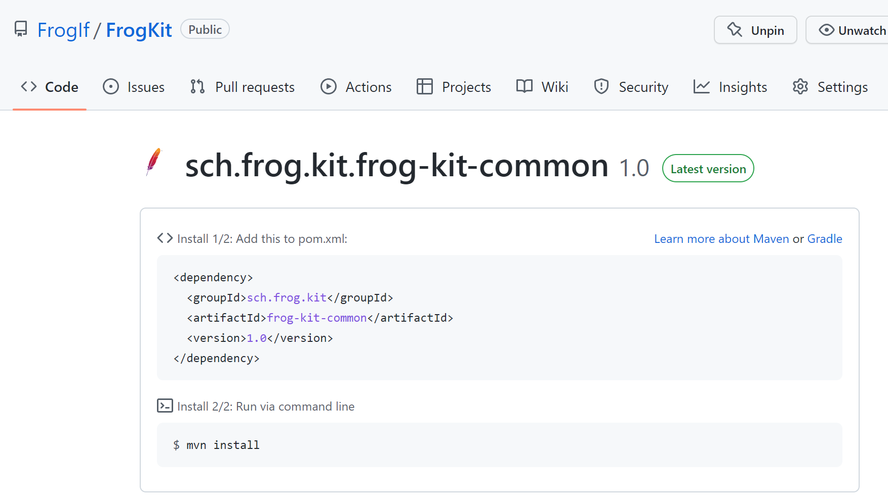

# Github

## Github Packages

这里介绍一下, 如何通过github packages, 发布自己的jar包, 以及使用自己的jar包.

首先, 抛出一个结论, github packages只有拥有token的人才能发布, 也只有拥有token的人才能使用.

> 这里基于2022年8月14日的github页面进行的介绍.

1. 创建token -- PAT, 具体是这样的. 头像-settings--developer settings--Personal access tokens, 如图:

2. 点击创建token按钮, 图上我创建了两个token, 一个是只读权限, 只能下载package, 一个有发布权限, 负责发布package
3. 首先在需要发布的gradle上, 进行配置:

```gradle
plugins {
    id("maven-publish")
}

version=1.0

publishing {
    repositories {
        maven {
            name = "GitHubPackages"
            url = uri("https://maven.pkg.github.com/frogif/FrogKit")
            credentials {
                username = project.findProperty("gpr.user") ?: System.getenv("GITHUB_USERNAME")
                password = project.findProperty("gpr.key") ?: System.getenv("GITHUB_PAT_TOKEN")
            }
        }
    }
    publications {
        gpr(MavenPublication) {
            from(components.java)
        }
    }
}
dependencies {
}
```
4. 这里我使用的是IDEA, 在环境变量中增加配置(这里面的token是使用的具有publish权限的token):



5. 然后执行IDEA的publish, 就自动将包发布到github上去了





6. 使用发布的jar包, 在需要依赖这个jar包的环境中配置就可以了, 就自动把包拉下来了(这里我直接把具有读权限的token直接粘进去了):

```gradle
repositories {
    mavenCentral()

    maven {
        url = uri("https://maven.pkg.github.com/frogif/FrogKit")
        credentials {
            username = 'frogif'
            password = 'xxxxxxxx'
        }
    }
}

dependencies {
    implementation 'sch.frog.kit:frog-kit-common:1.0'
}
```

## Reference

* [Github Packages With Gradle](https://docs.github.com/en/packages/working-with-a-github-packages-registry/working-with-the-gradle-registry)