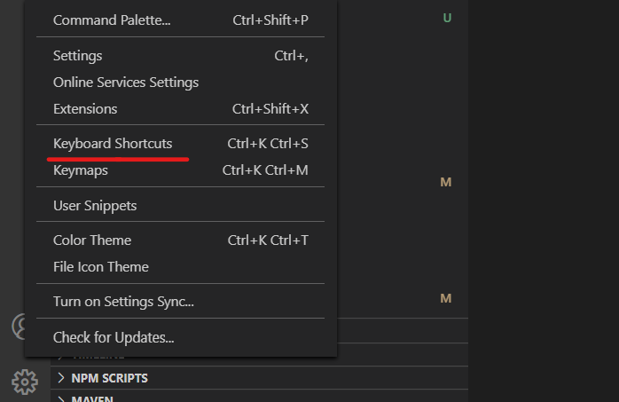
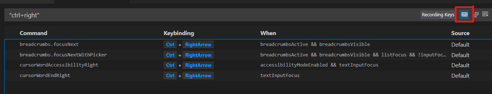

# VS Code使用笔记

## 常用插件

* Angular 8 Snippets
* Angular Files
* Angular Follow Selector
* Angular Language Service
* Debugger for Chrome
* Material Icon Theme
* Prettier
* TSLint
* VSCode Simpler Icons with angular icons
* GitLens -- 可以查看每一行代码的修改等, 很强大
* Java Extension Pack -- java开发工具包
* Git History -- Git历史查看
* Markdown Preview Enhanced -- markdown插件
* Markdown PDF -- markdown导出pdf和html等

## 快捷键冲突

VS code中, 如果安装了很多插件, 可能会出现快捷键冲突, 可以这样排查, 解决:




就可以找到冲突的快捷键了.

**快捷键修改**

* 全局搜索 - 默认ctrl + shift + f, 改成ctrl + H
* 全局保存 - 默认是ctrl + K, ctrl + S, 改成ctrl + shift + S
* 转换为大写 - 默认没有快捷键, 搜索upper, 添加, 输入 ctrl + shift + u, 同时删除原有快捷键, 防止冲突
* 转换为小写 - 默认没有快捷键, 搜索lower, 添加, 输入 ctrl + shift + l, 同时删除原有快捷键, 防止冲突
* quick fix - 就是执行小灯泡里的建议, 默认是ctrl + .  可能会有冲突, 这时可以按习惯修改

## 使用

**查看某个类的源码**
```
ctrl + P
输入#
输入要查询的类
```

**多行同时编辑**

```
1. 选中要编辑的一块文本
2. 按住ctrl + alt
3. 按上下键, 选择多行
4. 松开ctrl + alt
5. 可以开始多行编辑的具体行为了
```

## Markdown Preview Enhanced插件介绍

对于markdown, 一般的插件都支持将其导出为html, 但是如果想要导出的html中包含数学公式, 则需要使用这个插件:

1. 右键, "Markdown Preview Enhanced:Open Preview to the Side" 或者使用快捷键"Ctrl K V"
2. 在预览页面, 右键, 选择html, 导出即可