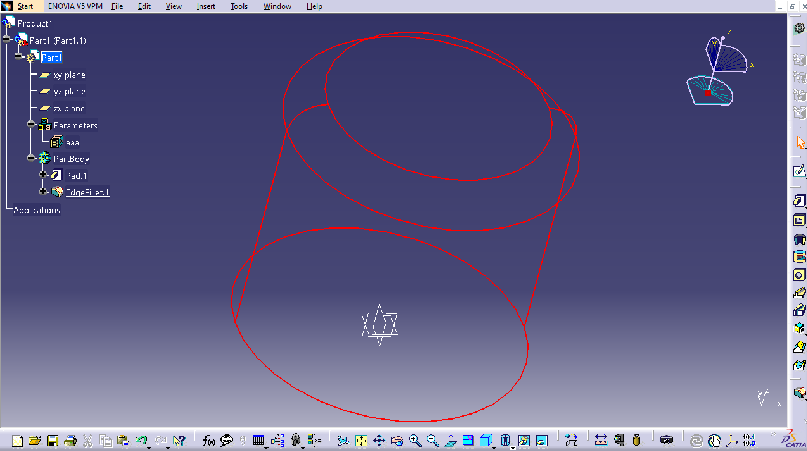
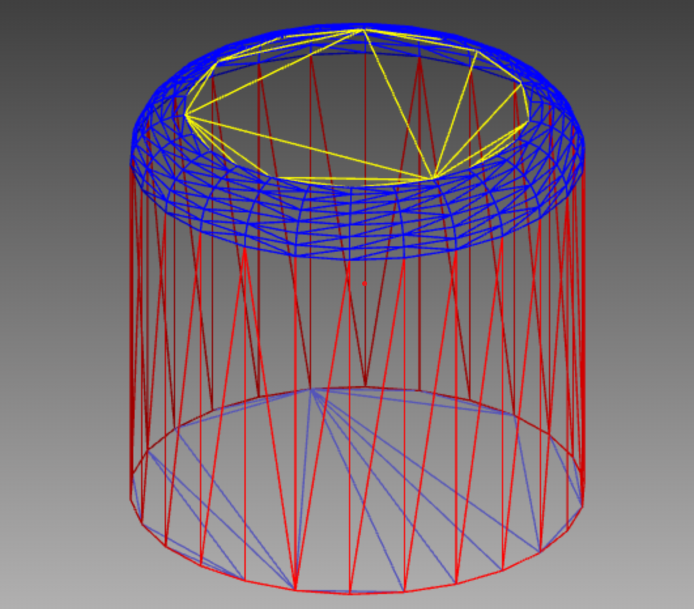
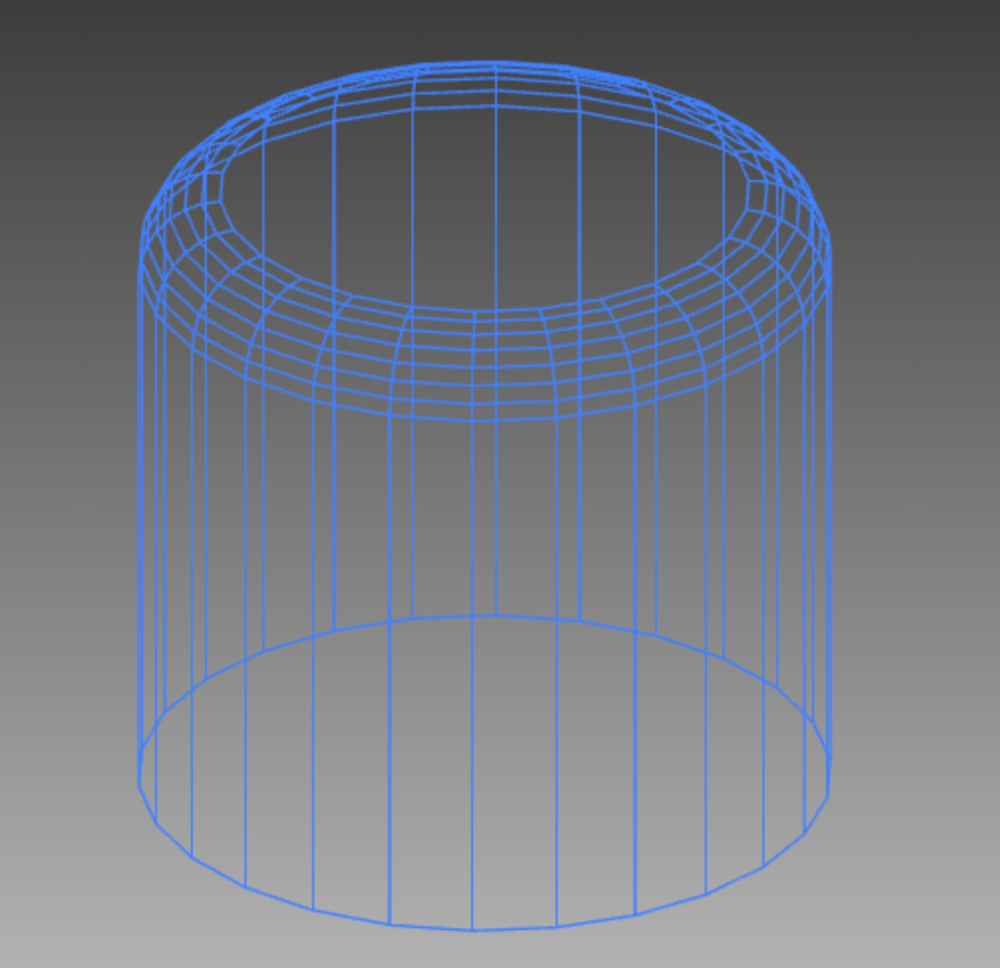
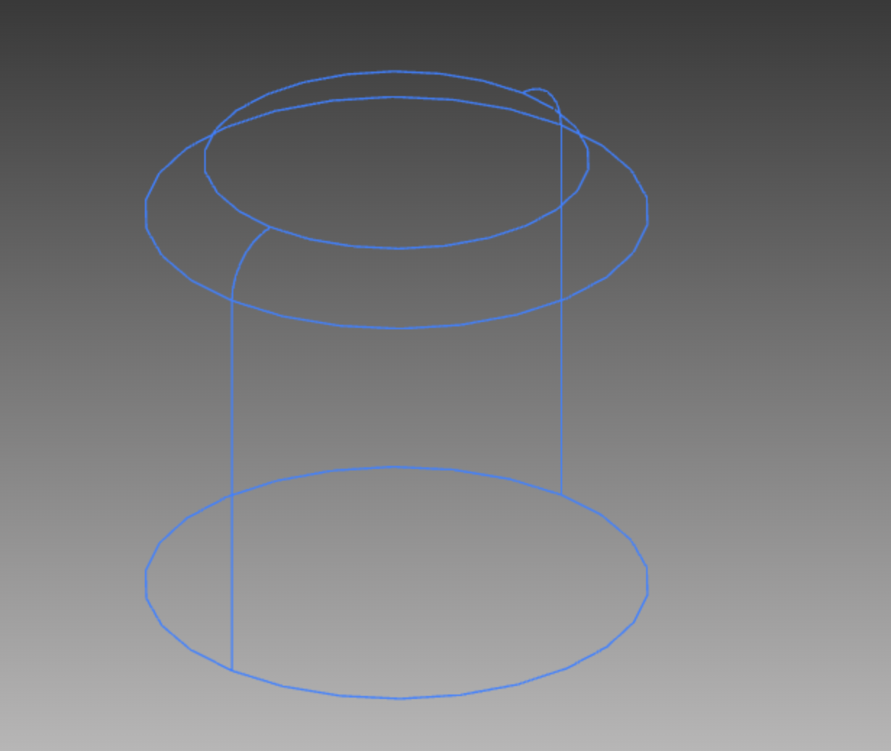

# threejs线框

## 概述

网上对threejs线框已经有大量的教程了, 但是如果开发的是一个CAD程序, 这些线框就不太合适了. 如图是catia中, 一个模型的线框效果:



对网上给出的线框方案做一个汇总, 然后给出实现catia中线框效果的一种方案.

* 通过材质中的属性来显示线框;
* 通过EdgesGeometry生成线框;
* 通过BufferGeometry中的position和index检测出线框(就是实现catia中线框的效果).

## 材质线框

关键代码如下:

```javascript
// 材质线框
function materialWireframe(model, isShow){
    if(model){
        model.traverse((child) => {
            if(child.isMesh){
                child.material.wireframe = isShow;
            }
        });
    }
}
```

效果如下:



## EdgesGeometry

关键代码如下:

```javascript
// EdgesGeometry线框
var line = null;
const lineMaterial = new THREE.LineBasicMaterial({color: 0x4080ff});
function edgeGeometryWireframe(model, isShow){
    if(model){
        if(!line){
            line = new THREE.Group();
            model.traverse(function(child){
                if (child.isMesh){
                    let edges = new THREE.EdgesGeometry(child.geometry);
                    let lineS= new THREE.LineSegments(edges, lineMaterial);
                    line.add(lineS);
                }
            });
            scene.add(line);
        }
        model.visible = !isShow;
        line.visible = isShow;
    }
}
```

效果如下:



> 此外, 像这样```new THREE.EdgesGeometry(child.geometry, 10)```, 可以通过增加一个参数, 这个参数的意思是相邻面的法线夹角, 这段代码就是指, 只有相邻面法线夹角大于10度(单位: 角度)时, 才会渲染边缘

## 通过BufferGeometry中的position和index画线框

这里说明一下, 每一个Mesh都是有两部分组成, 一部分是geometry, 一部分是material, 而geometry都是由一些点组成的, 每三个点为一组, 确定一个三角面, 一系列的三角面组成最终的模型. 这种画线方式思路是, 遍历这些三角面的边, 判断哪些边是多个三角面共用的, 如果是共用的, 那么就不是边缘; 如果不是共用的, 也就是只有一个三角面用到了这个边, 那么这个边就是一个mesh的边缘.

这里主要需要用到两个属性:

* xxxMesh.geometry.attributes.position -- 编织这个mesh的所有的点;
* xxxMesh.geometry.index -- 这些点是如何编织的

根据这两个属性, 就可以画出一个图形了, 具体过程如下:

假设, 有这样4个点: [(0, 0, 1), (0, 1, 0), (1, 0, 0), (1, 1, 0)],

那么在geometry中, geometry.attributes.position = [0, 0, 1, 0, 1, 0, 1, 0, 0, 1, 1, 0]

> 注意, 这里去掉了一些不必要的细节, geometry.attributes.position并不是一个数组.

然后, 如果0, 1, 2点确定了一个三角面, 1, 2, 3点确定了一个三角面.

那么, 在geometry.index = [0, 1, 2, 1, 2, 3], 即三个为一组, 共两个三角面.

根据上面的介绍, 就对Mesh的绘制有了一定的了解了. 接下来直接给出代码:

```javascript
// catia样式的线框
var catiaLine = null;
function catiaWireframe(model, isShow){
    if(model){
        if(!catiaLine){
            catiaLine = new THREE.Group();
            model.traverse(child => {
                if(child.isMesh){
                    let pointIndex = fetchEdgePoint(child);
                    if(pointIndex){
                        let posArr = child.geometry.attributes.position;
                        let points = new Array();
                        for(let i = 0; i < pointIndex.length; i += 2){
                            let k = pointIndex[i];
                            let p = pointIndex[i + 1];
                            points.push(new THREE.Vector3(posArr.getX(k), posArr.getY(k), posArr.getZ(k)));
                            points.push(new THREE.Vector3(posArr.getX(p), posArr.getY(p), posArr.getZ(p)));
                        }
    
                        if(points.length > 0){
                            const geometry = new THREE.BufferGeometry().setFromPoints(points);
                            catiaLine.add(new THREE.LineSegments(geometry, new THREE.LineBasicMaterial({color: 0x4080ff})));
                        }
                    }
                }
            });
            scene.add(catiaLine);
        }
        model.visible = !isShow;
        catiaLine.visible = isShow;
    }
}
// 边缘点探测
function fetchEdgePoint(mesh) {
    let pointIndexArr = mesh.geometry.index;
    if(pointIndexArr){
        let lineMap = new Map();
        let indexArr = pointIndexArr.array;
        for(let j = 0; j < indexArr.length; j += 3){
            let a = indexArr[j];
            let b = indexArr[j + 1];
            let c = indexArr[j + 2];
            let temp;
            if(a > b){ temp = b; b = a; a = temp; }
            if(a > c){ temp = a; a = c; c = temp; }
            if(b > c){ temp = b; b = c; c = temp; }

            let info = lineMap.get(a);
            if(!info){
                info = new Map();
                lineMap.set(a, info);
            }

            let co = info.get(b);
            info.set(b, co ? co + 1 : 1);
            co = info.get(c);
            info.set(c, co ? co + 1 : 1);
            
            info = lineMap.get(b);
            if(!info){
                info = new Map();
                lineMap.set(b, info);
            }
            co = info.get(c);
            info.set(c, co ? co + 1 : 1);
        }

        let pointIndex = new Array();
        for(let [k, v] of lineMap.entries()){
            for(let [p, count] of v.entries()){
                if(count == 1){
                    pointIndex.push(k);
                    pointIndex.push(p);
                }
            }
        }

        return pointIndex;
    }
    return null;
}
```

效果如下:




## 完整代码

除去three库以外, 完整代码如下:

```html
<!DOCTYPE html>
<html>
	<head>
		<meta charset="utf-8">
		<title>My first three.js app</title>
		<style>
			body { margin: 0; }
		</style>
	</head>
	<body style="background-image: linear-gradient(rgb(43, 43, 43), rgb(203, 202, 202));">
        <script type="importmap">
			{
				"imports": {
					"three": "./threejs/three.module.js"
				}
			}
		</script>
		<script type="module">
			import * as THREE from './threejs/three.module.js';
            import { GLTFLoader } from './threejs/jsm/loaders/GLTFLoader.js';
            import { RoomEnvironment } from './threejs/jsm/environments/RoomEnvironment.js';
            import { OrbitControls } from './threejs/jsm/controls/OrbitControls.js';

            const frustumSize = 1000;
            const aspect = window.innerWidth / window.innerHeight;

            const scene = new THREE.Scene();
            // const camera = new THREE.PerspectiveCamera(75, window.innerWidth / window.innerHeight, 0.01, 1000);
            const camera = new THREE.OrthographicCamera(frustumSize * aspect / - 2, frustumSize * aspect / 2, 
                frustumSize / 2, frustumSize / - 2, 0, 2000);
            camera.position.z = 5;

            const renderer = new THREE.WebGLRenderer({
                alpha: true, // 背景透明
                antialias: true // 抗锯齿
            });
            renderer.setSize(window.innerWidth, window.innerHeight);
            document.body.appendChild(renderer.domElement);

            const controls = new OrbitControls(camera, renderer.domElement);

            scene.environment = new THREE.PMREMGenerator(renderer).fromScene(new RoomEnvironment(), 0.04).texture;
            scene.add(new THREE.DirectionalLight( 0xFEFEFE ));

            function animate() {
                requestAnimationFrame( animate );
                renderer.render( scene, camera );
            }
            animate();

            const loader = new GLTFLoader();
            var model = null;
            loader.load("./vvv.glb", function(gltf){
                model = gltf.scene;
                scene.add(gltf.scene);
                adaptModelSize(gltf.scene, camera);
            },undefined, function ( error ) {
                console.log(error);
            });

            // 模型尺寸自适应
            function adaptModelSize(model, camera){
                var bBox = new THREE.Box3().setFromObject(model);

                let v = new THREE.Vector3();
                bBox.getSize(v);

                let c = new THREE.Vector3();
                bBox.getCenter(c);
                if(camera.isOrthographicCamera){    // 如果是正交相机
                    let start = new THREE.Vector3(0, 0, 0.5).unproject(camera);
                    let end = new THREE.Vector3(1, 1, 0.5).unproject(camera);
                    let len = start.sub(end).length();
                    let scale = len / Math.sqrt(window.innerHeight * window.innerHeight + window.innerWidth * window.innerWidth);
                    let height = window.innerHeight * scale;
                    let width = window.innerWidth * scale;
            
                    let maxSize = camera.near + c.length() + v.length();
                    camera.position.set(c.x, c.y, camera.far / 2 + maxSize);
                    camera.lookAt(model.position);
                    camera.zoom = Math.min(height / v.y, width / v.x);
                    camera.updateProjectionMatrix();
                }else if(camera.isPerspectiveCamera){ // 如果是透视相机
                    var dist = v.y / (Math.tan(camera.fov * Math.PI / 360) * 2);
                    camera.position.set(model.position.x, model.position.y, v.z + dist * 1.5);
                    camera.lookAt(c);
                }
            }

            window.onresize = () => {
                if(camera.isOrthographicCamera){
                    let aspect = window.innerWidth / window.innerHeight;
                    
                    camera.left = - frustumSize * aspect / 2;
                    camera.right = frustumSize * aspect / 2;
                    camera.top = frustumSize / 2;
                    camera.bottom = - frustumSize / 2;

                    camera.updateProjectionMatrix();
                    renderer.setSize( window.innerWidth, window.innerHeight );
                }else if(camera.isPerspectiveCamera){
                    camera.aspect = window.innerWidth / window.innerHeight;
                    camera.updateProjectionMatrix();
                }
                renderer.setSize(window.innerWidth, window.innerHeight);
            };

            // 材质线框
            function materialWireframe(model, isShow){
                if(model){
                    model.traverse((child) => {
                        if(child.isMesh){
                            child.material.wireframe = isShow;
                        }
                    });
                }
            }

            // EdgesGeometry线框
            var line = null;
            const lineMaterial = new THREE.LineBasicMaterial({color: 0x4080ff});
            function edgeGeometryWireframe(model, isShow){
                if(model){
                    if(!line){
                        line = new THREE.Group();
                        model.traverse(function(child){
                            if (child.isMesh){
                                let edges = new THREE.EdgesGeometry(child.geometry);
                                let lineS= new THREE.LineSegments(edges, lineMaterial);
                                line.add(lineS);
                            }
                        });
                        scene.add(line);
                    }
                    model.visible = !isShow;
                    line.visible = isShow;
                }
            }

            // catia样式的线框
            var catiaLine = null;
            function catiaWireframe(model, isShow){
                if(model){
                    if(!catiaLine){
                        catiaLine = new THREE.Group();
                        model.traverse(child => {
                            if(child.isMesh){
                                let pointIndex = fetchEdgePoint(child);
                                if(pointIndex){
                                    let posArr = child.geometry.attributes.position;
                                    let points = new Array();
                                    for(let i = 0; i < pointIndex.length; i += 2){
                                        let k = pointIndex[i];
                                        let p = pointIndex[i + 1];
                                        points.push(new THREE.Vector3(posArr.getX(k), posArr.getY(k), posArr.getZ(k)));
                                        points.push(new THREE.Vector3(posArr.getX(p), posArr.getY(p), posArr.getZ(p)));
                                    }
                
                                    if(points.length > 0){
                                        const geometry = new THREE.BufferGeometry().setFromPoints(points);
                                        catiaLine.add(new THREE.LineSegments(geometry, new THREE.LineBasicMaterial({color: 0x4080ff})));
                                    }
                                }
                            }
                        });
                        scene.add(catiaLine);
                    }
                    model.visible = !isShow;
                    catiaLine.visible = isShow;
                }
            }
            // 边缘点探测
            function fetchEdgePoint(mesh) {
                let pointIndexArr = mesh.geometry.index;
                if(pointIndexArr){
                    let lineMap = new Map();
                    let indexArr = pointIndexArr.array;
                    for(let j = 0; j < indexArr.length; j += 3){
                        let a = indexArr[j];
                        let b = indexArr[j + 1];
                        let c = indexArr[j + 2];
                        let temp;
                        if(a > b){ temp = b; b = a; a = temp; }
                        if(a > c){ temp = a; a = c; c = temp; }
                        if(b > c){ temp = b; b = c; c = temp; }

                        let info = lineMap.get(a);
                        if(!info){
                            info = new Map();
                            lineMap.set(a, info);
                        }

                        let co = info.get(b);
                        info.set(b, co ? co + 1 : 1);
                        co = info.get(c);
                        info.set(c, co ? co + 1 : 1);
                        
                        info = lineMap.get(b);
                        if(!info){
                            info = new Map();
                            lineMap.set(b, info);
                        }
                        co = info.get(c);
                        info.set(c, co ? co + 1 : 1);
                    }

                    let pointIndex = new Array();
                    for(let [k, v] of lineMap.entries()){
                        for(let [p, count] of v.entries()){
                            if(count == 1){
                                pointIndex.push(k);
                                pointIndex.push(p);
                            }
                        }
                    }

                    return pointIndex;
                }
                return null;
            }

            var showWireFrame = false;
            document.getElementById("materialBtn").addEventListener("click", function(){
                showWireFrame = !showWireFrame;
                materialWireframe(model, showWireFrame);
            });

            var showEdgesGeometry = false;
            document.getElementById("edgeBtn").addEventListener("click", function(){
                showEdgesGeometry = !showEdgesGeometry;
                edgeGeometryWireframe(model, showEdgesGeometry)
            });

            var showCatiaModel = false;
            document.getElementById("catiaBtn").addEventListener("click", function(){
                showCatiaModel = !showCatiaModel;
                catiaWireframe(model, showCatiaModel);
            });
		</script>
        <div style="position:absolute;right:0px;bottom:0px;width: 200px; height: 100px;border-radius: 5px;background-color: rgba(255,255,255,0.6);">
            <button id="materialBtn">材质线框</button>
            <button id="edgeBtn">EdgesGeometry线框</button>
            <button id="catiaBtn">Catia线框</button>
        </div>
	</body>
</html>
```

> 完整项目以及线上演示demo参见github: [simple-threejs](https://github.com/FrogIf/simple-threejs)